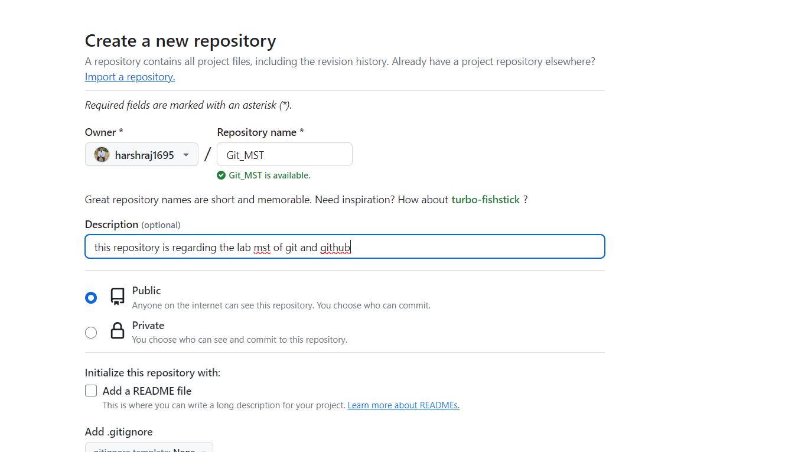
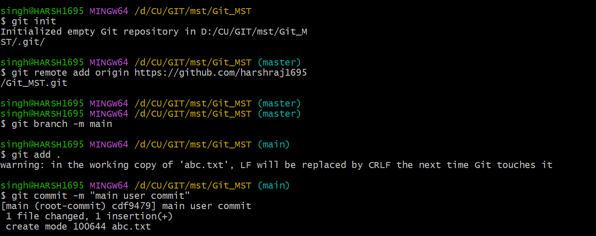
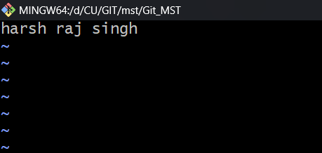
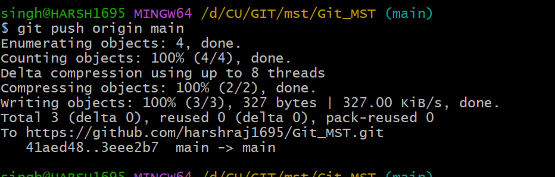
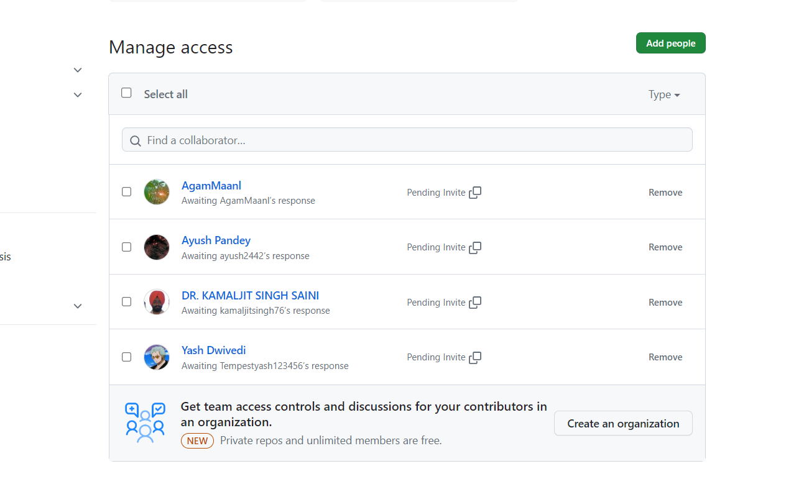
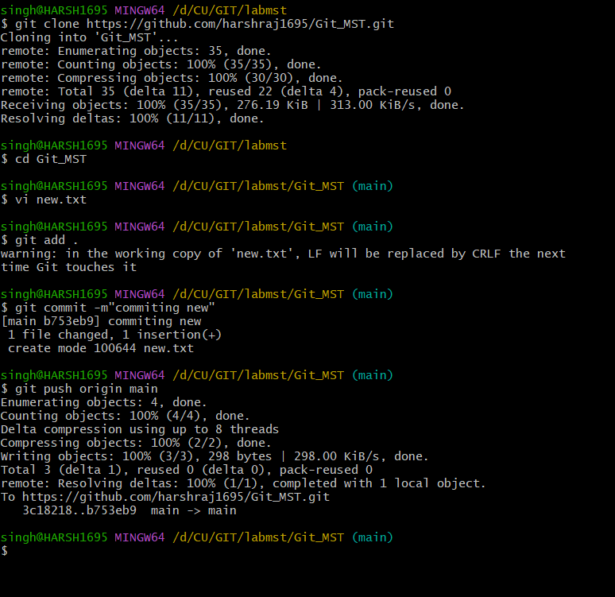
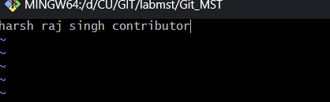

# Git_MST
## Problem Statement

Git Lab Exercise & Assignment: Remote workflow: Part – 2
Main Task
1. First, one person in the group should create a public repository using their GitHub account.
2. This same person should then follow the instructions from GitHub to add a remote, and then push their repository. Do not forget the –u flag, as suggested by GitHub!
3. All of the other members of the group should then be added as collaborators, so they can commit to the repository also.
4. Next, everyone else in the group should clone the repository from GitHub. Verify that the context of the repository is what is expected.
5. One of the group members who just cloned should now make a local commit, then push it. Everyone should verify that when they pull, that commit is added to their local repository (use git log to check for it).
6. Look at each other’s git log output. Notice how the SHA-1 is the same for a given commit across every copy of the repository. Why is this important?
7. Two members of the group should now make a commit locally, and race to push it. To keep things simple, be sure to edit different files. What happens to the runner-up?
8. The runner-up should now pull. As a group, look at the output of the command. Additionally, look at the git log, and notice that there is a merge commit. You may also wish to view the DAG in gitk.
9. Repeat the last two steps a couple of times, to practice.
Stretch Task
1. Now create a situation where two group members both edit the same line in the same file and commit it locally. Race to push.
2. When the runner-up does a pull, they should get a merge conflict.
3. Look as a group at the file in conflict, and resolve it.
4. Use the add command to stage the fix, and then use commit to make the merge commit. Notice how this procedure is exactly the one you got used to when resolving conflicts in branches.

   ## Solutions of the problem statement

  Go to GitHub account-> Go to repository -> Create New repository -> Name"Git_MST" -> select it as public-> none in git ignore -> "GNU public " in line -> Create repository.
  
 **1** Go to Github account-> Go to repository -> Create New repository -> Name"Git_MST" -> select it as public-> none in git ignore -> "GNU public " in lisene -> Create repository.
  

  **2** For adding remote into the git use the command "_git remote add origin url_" ad edit the file "vi abc.txt" and commit using"git commit -m "message""

  
  
  

  

   **3** Go to GitHub and add collaborators

  

  **4** Git clone "URL" and editing files
  

  

  
